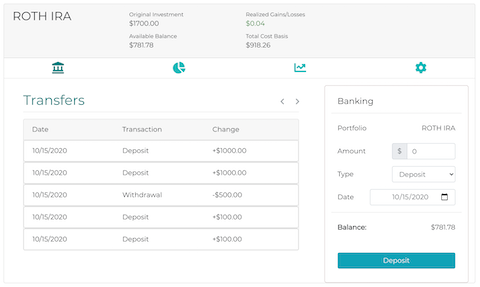

# Welcome to Money Box

Money Box is a web application designed to help you track and manage your stock portfolios all in one place. Equipped with real-time trade data, news and historical stock data, managing your portfolios just got easier.

## Table of Contents
* [Getting Started](#getting-started)
* [Features](#features)
* [Tech Stack](#tech-stack)
* [Tools](#tools)
* [License](#license)

## Getting Started

### Prerequisites

1. Install the [MoneyBox Rails Backend API](https://github.com/PeaWarrior/MoneyBox-back)
2. Install [Node.js and npm](https://www.npmjs.com/get-npm)

    ```console
    $ brew install node
    ```
### Initial Configuration
In order to take advantage of all features of **Money Box**, you must secure your own API key for the following API.

1. Register for developer API key for the following:
    * [Finnhub](https://finnhub.io/)

2. Create a new `.env` file in the root directory of this project.

    ```console
    $ touch .env
    ```

3. Add the API key to your `.env` file by copying the following and replacing the `<...>` with the correct corresponding key.

    ```env
    FINNHUB_API_KEY=<FINNHUB API KEY HERE>
    ```
4. Remember to add the `.env` file to your `.gitignore`.

### Starting the frontend server
1. Clone this repository and `cd` into the directory
2. Install all dependencies

   ```console
   $ npm install
   ```

3. Start the Frontend server

    ```console
    $ npm start
    ```

## Features

### Banking

* Deposit or withdraw to your portfolio
* View all banking transactions

### Visualize Stock Positions


* Visually compare stock positions through doughnut chart
* Hide symbols for specific comparisons


* View all stock positions and transactions

### Search Stocks

* Search any stocks that are actively trading through the NYSE by their symbol or company name
* View real time trade data and historical data


* View fundamental stock data
* View recent stock news

## Tech Stack
* React.js
* Redux
* Ruby on Rails API
* PostgreSQL
* HTML/CSS
* Bootstrap

## Tools
* [Rack CORS](https://github.com/cyu/rack-cors)
* [ActiveModel::Serializer](https://github.com/rails-api/active_model_serializers)
* [BCrypt](https://github.com/codahale/bcrypt-ruby)
* [rest-client](https://rubygems.org/gems/rest-client)
* [JWT](https://github.com/jwt/ruby-jwt)
* [React Router](https://reacttraining.com/react-router/web/guides/quick-start)
* [MomentJS](https://momentjs.com/)
* [Chart.js](https://github.com/jerairrest/react-chartjs-2)
* [WebSockets](https://developer.mozilla.org/en-US/docs/Web/API/WebSockets_API)
* [IEX API](https://iexcloud.io/)
* [Finnhub API](https://finnhub.io/)
* [TD Ameritrade API](https://developer.tdameritrade.com/)

## License

Money Box is released under the [MIT License](https://opensource.org/licenses/MIT).
